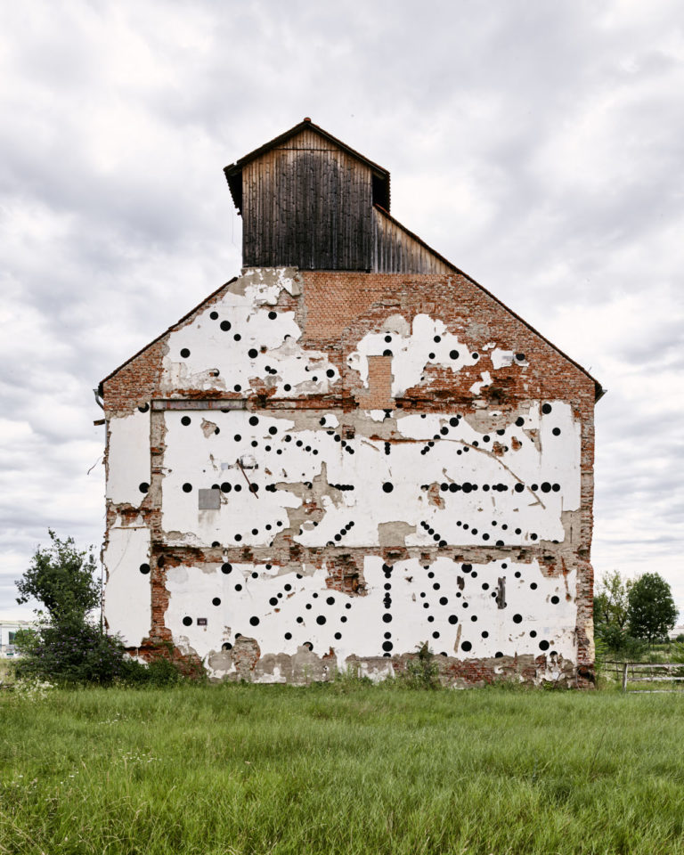

# for_for_for_you

Site specific installation in Graz/Reininghaus (AT) in 2017. By Matthias Jäger and [Bernhard Wolf](https://bernhardwolf.at/). One frame of the javascript animation for(for(for(you))) was transformed into a mural. We were allowed to paint on the fascade of the Tennenmälzerei, a beautiful building in an abandoned development area in town. Many thanks to Asset One, ASVK and Bundesdenkmalamt Österreich for supporting our ideas. Thanks to L. Rabensteiner, Alexander Krischner, Simon Oberhofer for the photos and to Ochoresotto for the huge video projector. Many thanks to Haus der Architektur and Diagonale for sharing the opening. The installation is accessible to the public and can be visited until summer 2018.

https://matthias-jaeger-net.github.io/for_for_for_you/
